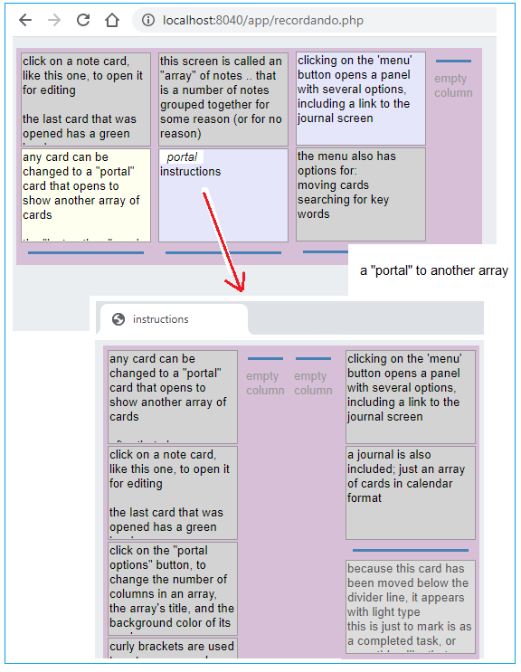
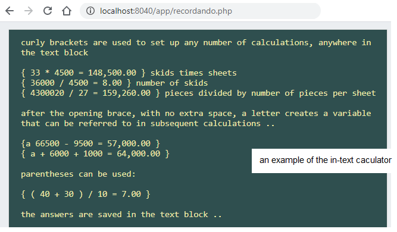
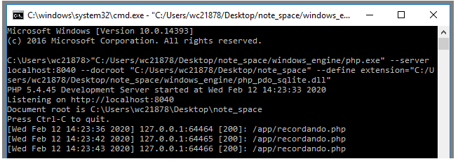
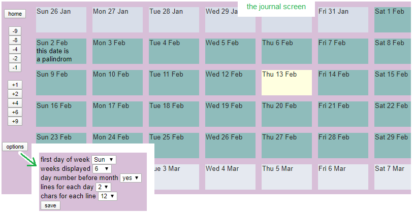

## recordando
recordando is a small PHP program to edit a collection of notes, and to show those notes in the simplest way.
 
It shows an array of cards; any card can be set as a "portal" to lead to another array.
 
There are very few features here .. moving cards around, changing a card's color, searching for text .. it's a program for people who don't want anything more.
 

 
It does have one more feature .. a calculating function that works within a block of text.
 

 
It is designed to run as a PHP desktop application installed locally on any Windows, Macintosh or Linux personal computer or laptop. To use it on an Android device or on a Chromebook, you could run PHP with the Termux app.  On an iPhone or iPad, you could run PHP with the PHPWin app (free with ads) or Draftcode (a very small purchase).
 
There is a html page, "start_on_any_computer.htm", that displays the text of a command for you to copy & paste into a terminal window that you open for yourself.
 
Most people will consider that to be too much effort .. but, it does mean that there is not a hidden process running.
 
After that, you click on the "my recordando" link to see the results of the .php file.
 

 
You'll probably want to minimize the terminal window ..
 

 
The notes are saved in a sqlite file on the local computer; nothing is on the internet .. though you could place the program in some sort of file-sharing system.
 
 
The download includes a small PHP "engine" for use on Windows; Macintosh has PHP built in, and Linux users can install PHP from repository.
 
The PHP engine is just 3 files from the php-5.4.45-Win32-VC9-x86.zip file at windows.php.net/downloads/releases/archives .
 
(The 5.4 version was chosen because its Visual C runtime requirement is compatiable with older PCs).
 
 
The program is also offers a daily journal entry screen.
 

 
'recordando' in Spanish translates to 'remembering' in English
 
 
for questions or comments, you can contact the author at tomhyde2@gmail.com
 
